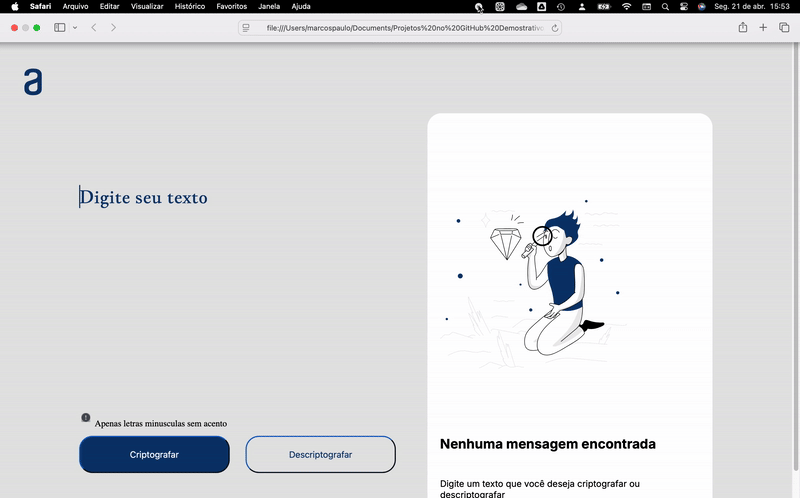

## 🔒 Encriptador 

## 🚀 Funcionalidades
Foi criado um Encriptador, um programa que realiza a criptografia de palavras. Nele, você digita uma palavra e o sistema a criptografa automaticamente. Além disso, também é possível realizar o processo inverso: descriptografar a palavra e retornar ao texto original

Foi desenvolvido junto com a parceria Oracle e Alura (Desafio de Front End).

## Demostração do Encriptador

Abaixo mostro como ficou o desafio.

